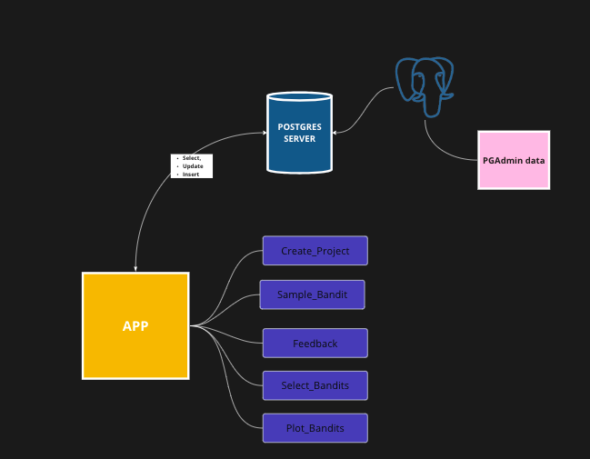

# Project Description

Our project develops a Dockerized A/B Testing Platform that integrates the Thompson Sampling algorithm to optimize digital marketing strategies by dynamically selecting the most effective content to display to users. This platform is designed to adapt in real-time, continuously learning and adjusting based on user interactions. By leveraging statistical models and Docker's scalability and isolation features, the platform offers a robust, efficient solution for conducting A/B tests across various digital interfaces.

##Objectives:

Dynamic Content Optimization: Utilize real-time data to dynamically select content that maximizes user engagement and conversion rates.
Scalability and Isolation: Implement the platform within a Dockerized environment to ensure that it can scale according to demand without compromising the performance of individual components.
User-Driven Insights: Generate actionable insights based on user feedback, enhancing the decision-making process for content strategies.
Visualization and Reporting: Provide intuitive visual representations of A/B test performances, helping marketers understand trends and make informed decisions.

##Key Components:

Postgres Server: Acts as the central database, storing all relevant data concerning the A/B tests, including user responses and interaction outcomes.
PGAdmin Interface: Allows for sophisticated database management and monitoring, facilitating easy adjustments and maintenance.
Application Layer (APP): Serves as the operational front end, where all A/B testing procedures are managed and executed. This includes:
Create_Project: Set up and define parameters for new A/B testing campaigns.
Sample_Bandit: Implements the Thompson Sampling algorithm to select the most promising content variation based on prior results.
Feedback: Processes and records user interactions to update the testing algorithm.
Select_Bandits and Plot_Bandits: Facilitate the selection of test groups for comparative analysis and the graphical presentation of results, respectively.

##Technological Stack:

* Docker: Ensures that each component of the platform can be independently deployed and scaled.
* PostgreSQL: Provides robust data storage capabilities.
* Python: Used in the API container to handle logic and server-side functions.
* pgAdmin: Offers a web-based interface for database management.

##Flowchart
   

##Prerequisites

Before setting up the project, you need to have Docker and Docker Compose installed. Use the following links to download and install them on your system:

* Docker: [Install Docker](https://docs.docker.com/get-docker/)
* Docker Compose: [Install Docker Compose](https://docs.docker.com/compose/install/)

